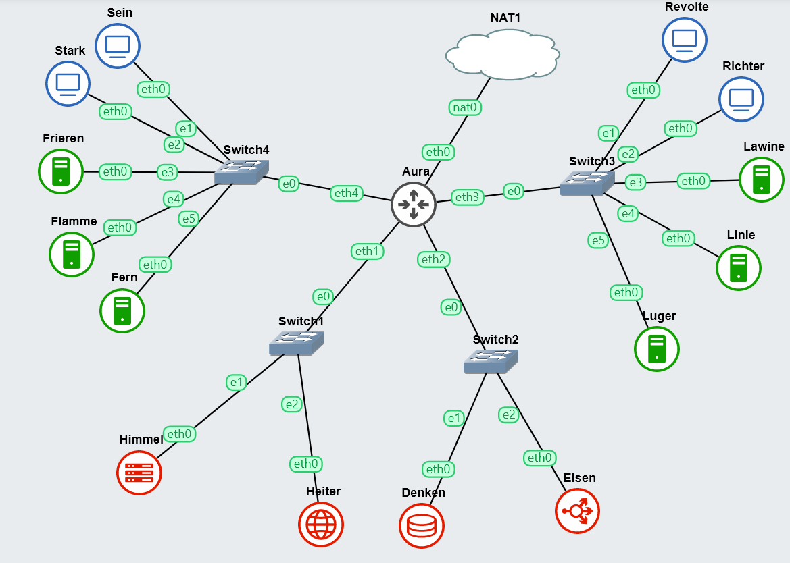
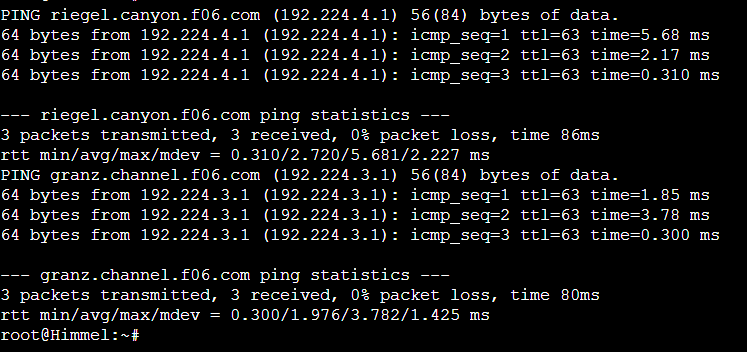
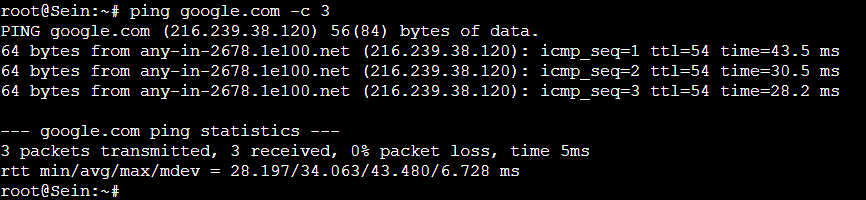
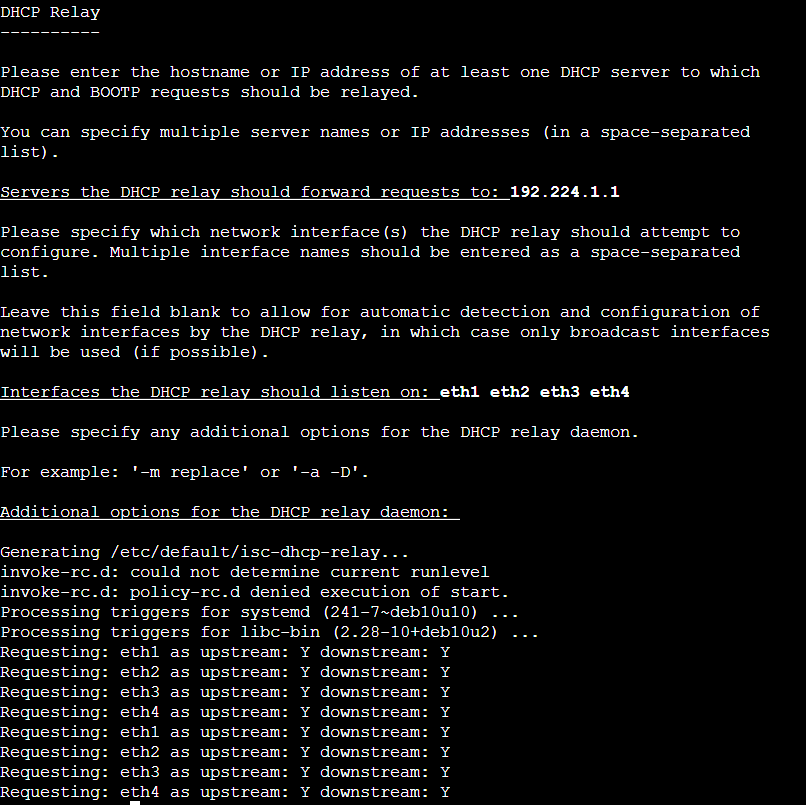
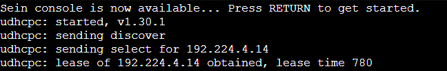
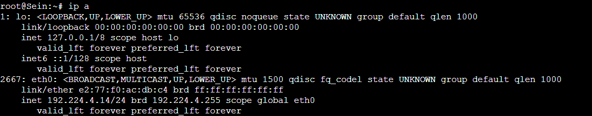
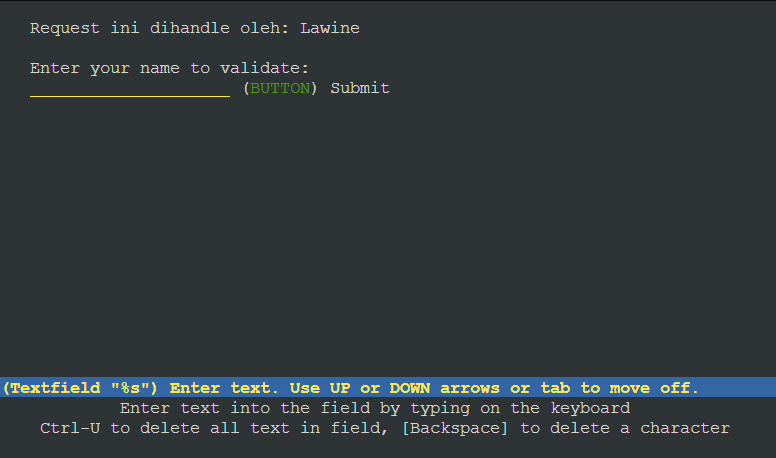
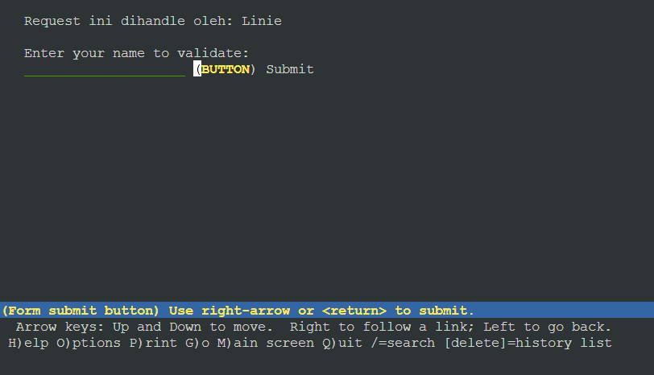
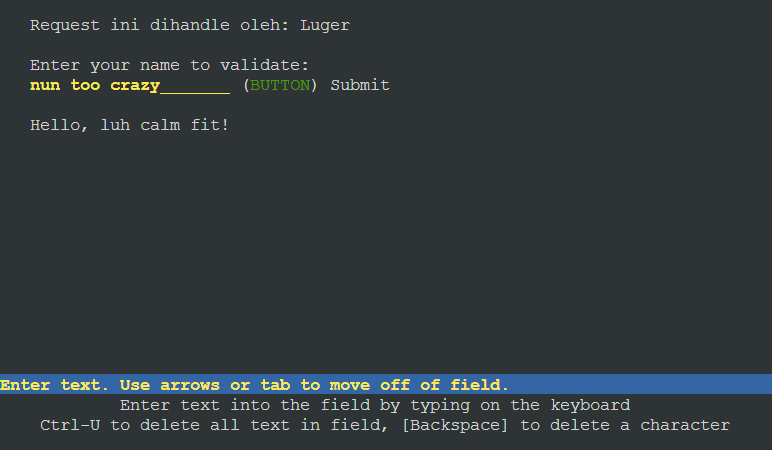

# Jarkom-Modul-3-F06-2023

Kelompok F06:
- Arkana Bilal Imani / 5025211034
- Azhar Abiyu Rasendriya H. / 5025211177

## Daftar Isi

- [Laporan Resmi](#laporan-resmi)
  - [Daftar Isi](#daftar-isi)
  - [Topologi](#topologi)
  - [Konfig Node](#konfig)
- [No.0 - Konfigurasi DNS](#Soal-0)
- [No.1-5 - Konfigurasi DHCP](#Soal-1-5)
- [No. 2 - DNS](#Soal-2)
- [No. 3 - DNS](#Soal-3)
- [No. 4 - DNS](#Soal-4)
- [No. 5 - DNS](#Soal-5)
- [No. 6 - DNS](#Soal-6)
- [No. 7 - DNS](#Soal-7)
- [No. 8 - DNS](#Soal-8)
- [No. 9 & 10 - Webserver](#Soal-9-10)
 
### Topologi



### Konfig

- Aura (Router)
```
auto eth0
iface eth0 inet dhcp

auto eth1
iface eth1 inet static
	address 192.224.1.0
	netmask 255.255.255.0

auto eth2
iface eth2 inet static
	address 192.224.2.0
	netmask 255.255.255.0

auto eth3
iface eth3 inet static
	address 192.224.3.0
	netmask 255.255.255.0

auto eth4
iface eth4 inet static
	address 192.224.4.0
	netmask 255.255.255.0
```
- Switch 1
  - Himmel
    ```
    auto eth0
    iface eth0 inet static
    	address 192.224.1.1
    	netmask 255.255.255.0
    	gateway 192.224.1.0
    ```
  - Heiter
    ```
    auto eth0
    iface eth0 inet static
    	address 192.224.1.2
    	netmask 255.255.255.0
    	gateway 192.224.1.0
    ```
- Switch 2
  - Denken
    ```
    auto eth0
    iface eth0 inet static
    	address 192.224.2.1
    	netmask 255.255.255.0
    	gateway 192.224.2.0
    ```
  - Eisen
    ```
    auto eth0
    iface eth0 inet static
    	address 192.224.2.2
    	netmask 255.255.255.0
    	gateway 192.224.2.0
    ```
- Switch 3
  - Lawine
    ```
    auto eth0
    iface eth0 inet static
    	address 192.224.3.1
    	netmask 255.255.255.0
    	gateway 192.224.3.0
    ```
  - Linie
    ```
    auto eth0
    iface eth0 inet static
    	address 192.224.3.2
    	netmask 255.255.255.0
    	gateway 192.224.3.0
    ```
  - Luger
    ```
    auto eth0
    iface eth0 inet static
    	address 192.224.3.3
    	netmask 255.255.255.0
    	gateway 192.224.3.0
    ```
  - Revolte
    ```
    auto eth0
    iface eth0 inet dhcp
    ```
  - Reichter
    ```
    auto eth0
    iface eth0 inet dhcp
    ```
- Switch 4
  - Frieren
    ```
    auto eth0
    iface eth0 inet static
    	address 192.224.4.1
    	netmask 255.255.255.0
    	gateway 192.224.4.0
    ```
  - Flamme
    ```
    auto eth0
    iface eth0 inet static
    	address 192.224.4.2
    	netmask 255.255.255.0
    	gateway 192.224.4.0
    ```
  - Fern
    ```
    auto eth0
    iface eth0 inet static
    	address 192.224.4.3
    	netmask 255.255.255.0
    	gateway 192.224.4.0
    ```
  - Sein
    ```
    auto eth0
    iface eth0 inet dhcp
    ```
  - Stark
    ```
    auto eth0
    iface eth0 inet dhcp
    ```
## Soal-0
Setelah mengalahkan Demon King, perjalanan berlanjut. Kali ini, kalian diminta untuk melakukan register domain berupa `riegel.canyon.yyy.com` untuk worker Laravel dan `granz.channel.yyy.com` untuk worker PHP mengarah pada worker yang memiliki IP [prefix IP].x.1.  

Yang diperlukan untuk menyelesaikan soal ini adalah melakukan command `iptables` di Aura sebagai berikut:
```shell
iptables -t nat -A POSTROUTING -o eth0 -j MASQUERADE -s 192.224.0.0/16
```
Lalu install DNS di Heiter karena Heiter adalah DNS server di topologi ini dengan skrip berikut:
```shell
echo nameserver 192.168.122.1 > /etc/resolv.conf
apt-get update
apt-get install bind9 -y
service bind9 start
```
Setelah terinstall, tambahkan konfigurasi untuk `riegel.canyon.yyy.com` dan `granz.channel.yyy.com` yang mengarah ke `192.224.x.1` dengan skrip berikut:
```shell
cho 'zone "canyon.f06.com" {
        type master;
        file "/etc/bind/jarkom/canyon.f06.com";
};' > /etc/bind/named.conf.local

mkdir /etc/bind/jarkom

cp /etc/bind/db.local /etc/bind/jarkom/canyon.f06.com

echo ';
; BIND data file for local loopback interface
;
$TTL    604800
@       IN      SOA     canyon.f06.com. root.canyon.f06.com. (
                              2         ; Serial
                         604800         ; Refresh
                          86400         ; Retry
                        2419200         ; Expire
                         604800 )       ; Negative Cache TTL
;
@       IN      NS      canyon.f06.com.
@       IN      A       192.224.2.2 ; IP Eisen
riegel  IN      A       192.224.4.1 ; IP Frieren
' > /etc/bind/jarkom/canyon.f06.com


echo 'zone "granz.channel.f06.com" {
        type master;
        file "/etc/bind/jarkom/granz.channel.f06.com";
};' >> /etc/bind/named.conf.local

cp /etc/bind/db.local /etc/bind/jarkom/granz.channel.f06.com

echo ';
; BIND data file for local loopback interface
;
$TTL    604800
@       IN      SOA     granz.channel.f06.com. root.granz.channel.f06.com. (
                              2         ; Serial
                         604800         ; Refresh
                          86400         ; Retry
                        2419200         ; Expire
                         604800 )       ; Negative Cache TTL
;
@       IN      NS      granz.channel.f06.com.
@       IN      A       192.224.3.1 ; IP Lawine
www     IN      CNAME   granz.channel.f06.com.
' > /etc/bind/jarkom/granz.channel.f06.com

echo '
options {
        directory "/var/cache/bind";

         forwarders {
                192.168.122.1;
         };

        //dnssec-validation auto;
        allow-query{any;};
        listen-on-v6 { any; };
};
' > /etc/bind/named.conf.options

service bind9 restart
```
Untuk domain `riegel.canyon.yyy.com`, riegel dijadikan subdomain dari canyon.yyy.com memisahkan cara mengakses worker Frieren secara langsung dengan mengakses lewat load balancer Eisen dengan default domain tersebut. Dalam konfigurasi DNS ini juga ada forwarder yang mengarah ke IP 192.168.122.1 yang menghubungkan DNS ini ke internet untuk keperluan install dan update pada soal soal selanjutnya.  

Setelah konfigurasi, DNS server dapata dites dengan skrip berikut di node manapun (kecuali client karena DHCP belum dikonfigurasi).
```shell
echo nameserver 192.224.1.2 > /etc/resolv.conf
ping riegel.canyon.f06.com -c 3
ping granz.channel.f06.com -c 3
```
  
Berikut adalah hasil tesnya: 


## Soal-1-5
Lakukan konfigurasi sesuai dengan peta yang sudah diberikan.  

Kemudian, karena masih banyak spell yang harus dikumpulkan, bantulah para petualang untuk memenuhi kriteria berikut.:  
- Semua CLIENT harus menggunakan konfigurasi dari DHCP Server.
- Client yang melalui Switch3 mendapatkan range IP dari [prefix IP].3.16 - [prefix IP].3.32 dan [prefix IP].3.64 - [prefix IP].3.80 
- Client yang melalui Switch4 mendapatkan range IP dari [prefix IP].4.12 - [prefix IP].4.20 dan [prefix IP].4.160 - [prefix IP].4.168 
- Client mendapatkan DNS dari Heiter dan dapat terhubung dengan internet melalui DNS tersebut
- Lama waktu DHCP server meminjamkan alamat IP kepada Client yang melalui Switch3 selama 3 menit sedangkan pada client yang melalui Switch4 selama 12 menit. Dengan waktu maksimal dialokasikan untuk peminjaman alamat IP selama 96 menit

Yang diperlukan untuk melakukan konfigurasi DHCP adalah menginstall DHCP di Himmel karena Himmel sudah ditentukan sebagai DHCP server dengan skrip berikut:
```shell
echo nameserver 192.168.122.1 > /etc/resolv.conf
apt-get update
apt-get install isc-dhcp-server -y
apt-get --reinstall install rsyslog

service rsyslog start

dhcpd --version
```
Service rsyslog digunakan untuk membuat log file karena segala error di konfigurasi DHCP akan masuk ke situ.  

Setelah melakukan proses instalasi tersebut, DHCP bisa dikonfigurasikan dengan skrip berikut:
```shell
echo '
subnet 192.224.1.0 netmask 255.255.255.0{
}

subnet 192.224.2.0 netmask 255.255.255.0{
}

subnet 192.224.3.0 netmask 255.255.255.0 {
    range 192.224.3.16 192.224.3.32;
    range 192.224.3.64 192.224.3.80;
    option routers 192.224.3.0;
    option broadcast-address 192.224.3.255;
    option domain-name-servers 192.224.1.2;
    default-lease-time 180;
    max-lease-time 5760;
}
subnet 192.224.4.0 netmask 255.255.255.0 {
    range 192.224.4.12 192.224.4.20;
    range 192.224.4.160 192.224.4.168;
    option routers 192.224.4.0;
    option broadcast-address 192.224.4.255;
    option domain-name-servers 192.224.1.2;
    default-lease-time 780;
    max-lease-time 5760;
}' > /etc/dhcp/dhcpd.conf

echo '
INTERFACESv4="eth0"
' > /etc/default/isc-dhcp-server

service isc-dhcp-server restart
```
Di konfigurasi tersebut, subnet 192.224.3.0 diset dengan range 192.224.3.16 - 192.224.3.32 dan range 192.224.3.64 - 192.224.3.80 untuk memenuhi soal nomor 2.
Untuk subnet 192.224.4.0, diberikan range 192.224.4.12 - 192.224.20 dan range 192.224.4.160 - 192.224.4.168 untuk memenuhi soal nomor 3.  

Untuk nomor 4, karena `option domain-name-servers` diset untuk mengarah ke DNS server, yaitu Heiter di IP 192.224.1.2, client (Sein, Stark, Revolte, Reichter) secara otomatis menggunakan DNS server tersebut. Karena DNS server di Heiter sudah dikonfigurasikan dengan forwarder, maka client dapat mengakses web server yang sudah di list di DNS (Riegel dan Granz) dan tersambung ke internet juga melalui IP di forwarder.  

Berikut adalah bukti sudah bisa terhubung dengan internet:


Untuk nomor 5, untuk mengatur lama waktu IP dipinjamkan ke client secara default dan maksimal, dapat melalui `default-lease-time` dan `max-lease-time` yang dikonfigurasikan sesuai dengan permintaan soal. Karena angka yang dimasukkan ke dalam parameter tersebut bersifat detik, maka angka menit harus dikali 60 terlebih dahulu.  
  
Setelah dilakukan konfigurasi di Himmel sebagai DHCP server, diperlukan juga konfigurasi di Aura sebagai DHCP relay dengan skrip berikut:  
```shell
apt-get update
apt-get install isc-dhcp-relay -y

echo net.ipv4.ip_forward=1 > /etc/sysctl.conf
service isc-dhcp-relay start
service isc-dhcp-relay restart
```
Saat menginstall DHCP relay, akan diprompt untuk konfigurasi IP DHCP server, interface yang akan tersambung, dan modifier lain.  
- IP yang digunakan untuk DHCP server adalah IP Himmel di `192.224.1.1`.  
- Interface yang akan tersambung dengan DHCP relay adalah eth1, eth2, eth3 dan eth4 sesuai dengan konfigurasi network di aura untuk menyambungkan semua subnet karena konfigurasi DHCP server di Himmel juga mendaftarkan setiap subnet. Maka dari itu list interface tersebut harus sama dengan konfigurasi relay supaya sistem DHCP ini dapat bekerja.  
- Modifier lain bisa dibiarkan kosong.  
  
Berikut adalah prompt konfigurasinya:
  

  
Untuk melakukan tes DHCP sudah bekerja atau belum, yang dilakukan adalah stop dan start client, lalu membuka web console bagi client tersebut untuk melihat bahwa client sudah dipinjamkan IP sesuai dengan range yang sudah ditentukan. Proses peminjaman ini seharusnya sudah terlihat saat web console dibuka. Apabila tidak terlihat, maka bisa dilihat menggunakan command `ip a`.  
Berikut adalah contoh gambarnya:  
  



## Soal 6
Pada masing-masing worker PHP, lakukan konfigurasi virtual host untuk website [berikut](https://drive.google.com/file/d/1ViSkRq7SmwZgdK64eRbr5Fm1EGCTPrU1/view?usp=sharing) dengan menggunakan php 7.3.  

Yang perlu dilakukan pertama-tama adalah menginstall semua hal yang dibutuhkan untuk deploy website tersebut, bisa menggunakan skrip berikut:
```shell
echo nameserver 192.168.122.1 > /etc/resolv.conf
apt-get update
apt-get install php7.3 -y
php -v
apt-get install nginx -y
nginx -v
service nginx start
apt-get install php-fpm -y
service php7.3-fpm start
service php7.3-fpm restart
apt-get install wget unzip -y
apt-get install htop -y

# wget --no-check-certificate 'https://docs.google.com/uc?export=download&id=1ViSkRq7SmwZgdK64eRbr5Fm1EGCTPrU1' -O granz.channel.f06.com.zip
unzip granz.channel.f06.com.zip 
mkdir /var/www/granz
mv -v modul-3/* /var/www/granz/
rm -rf modul-3/
```  
Selain PHP versi 7.3 dan Nginx yang diinstall, beberapa service lain seperti php7.3-fpm, wget, unzip, dan htop yang diperlukan untuk nomor nomor selanjutnya juga sekalian diinstall di skrip tersebut. Service wget dan unzip digunakan untuk mendownload file yang diperlukan untuk websitenya seperti index.php dan lain lain, dan setelah di download, file .zip tersebut diunzip dengan unzip dan dipindahkan ke folder /var/www/granz.  
  
Setelah proses install selesai, virtual host untuk website granz bisa dikonfigurasikan dengan skrip berikut:  
```shell
rm /var/www/html/index.html
rm -rf /etc/nginx/sites-enabled/default

touch /etc/nginx/sites-available/granz
echo '
server {

        listen 80;

        root /var/www/granz;

        index index.php index.html index.htm;
        server_name granz.channel.f06.com;

        location / {
                        try_files $uri $uri/ /index.php?$query_string;
        }

        # pass PHP scripts to FastCGI server
        location ~ \.php$ {
        include snippets/fastcgi-php.conf;
        fastcgi_pass unix:/var/run/php/php7.3-fpm.sock;
        }
        location ~ /\.ht {
                        deny all;
        }

        error_log /var/log/nginx/granz_error.log;
        access_log /var/log/nginx/granz_access.log;
}
' > /etc/nginx/sites-available/granz

ln -s /etc/nginx/sites-available/granz  /etc/nginx/sites-enabled
service nginx restart
nginx -t
```
Untuk menghindari terhubung ke default page Nginx, file index.html dan konfigurasi virtual host default dihapus.  

Lalu file granz dibuat sebagai konfigurasi virtual host dengan root mengarah ke /var/www/granz dan file tersebut akan dibuatkan link ke folder /etc/nginx/sites-enabled untuk mengaktifkan konfigurasi virtual hostnya. Hal ini dilakukan tiga kali di worker PHP (Lawine, Linie, Luger).  

Setelah itu, perlu dilakukan konfigurasi load balancer juga untuk menghandle pembagian kerja worker PHP tersebut, dengan menggunakan skrip berikut:  
```shell
echo nameserver 192.168.122.1 > /etc/resolv.conf
apt-get update
apt-get install nginx -y
apt-get install apache2-utils -y
apt-get install htop -y

service nginx start
service nginx status
```
Skrip tersebut juga menginstall apache2-utils dan htop yang akan berguna untuk nomor nomor selanjutnya.  
```shell

touch /etc/nginx/sites-available/lb-eisen

echo '
upstream myweb  {
	server 192.224.3.1; 
	server 192.224.3.2; 
  server 192.224.3.3; 
}

server {
	listen 80;
	server_name granz.channel.f06.com;

	location / {
	proxy_pass http://myweb;
	}
}' > /etc/nginx/sites-available/lb-eisen

ln -s /etc/nginx/sites-available/lb-eisen /etc/nginx/sites-enabled

service nginx start
service nginx restart
rm /var/www/html/index.html
rm -rf /etc/nginx/sites-enabled/default

nginx -t
```
Hal yang pertama dilakukan adalah membuat file konfigurasi di folder /etc/nginx/sites-available bernama lb-eisen. lalu dimasukkan konfigurasi tersebut dengan semua IP worker PHP (Lawine, Linie, dan Luger) menjadi worker. server_name juga diset menjadi granz.channel.f06.com agar saat mengetes menggunakan lynx atau ab, tidak perlu menggunakan IP Eisen.  

Berikut adalah hasil lynx load balancer dengan worker PHP: 






## Soal-7
Kepala suku dari Bredt Region memberikan resource server sebagai berikut:
- Lawine, 4GB, 2vCPU, dan 80 GB SSD.
- Linie, 2GB, 2vCPU, dan 50 GB SSD.
- Lugner 1GB, 1vCPU, dan 25 GB SSD.
aturlah agar Eisen dapat bekerja dengan maksimal, lalu lakukan testing dengan 1000 request dan 100 request/second. 


